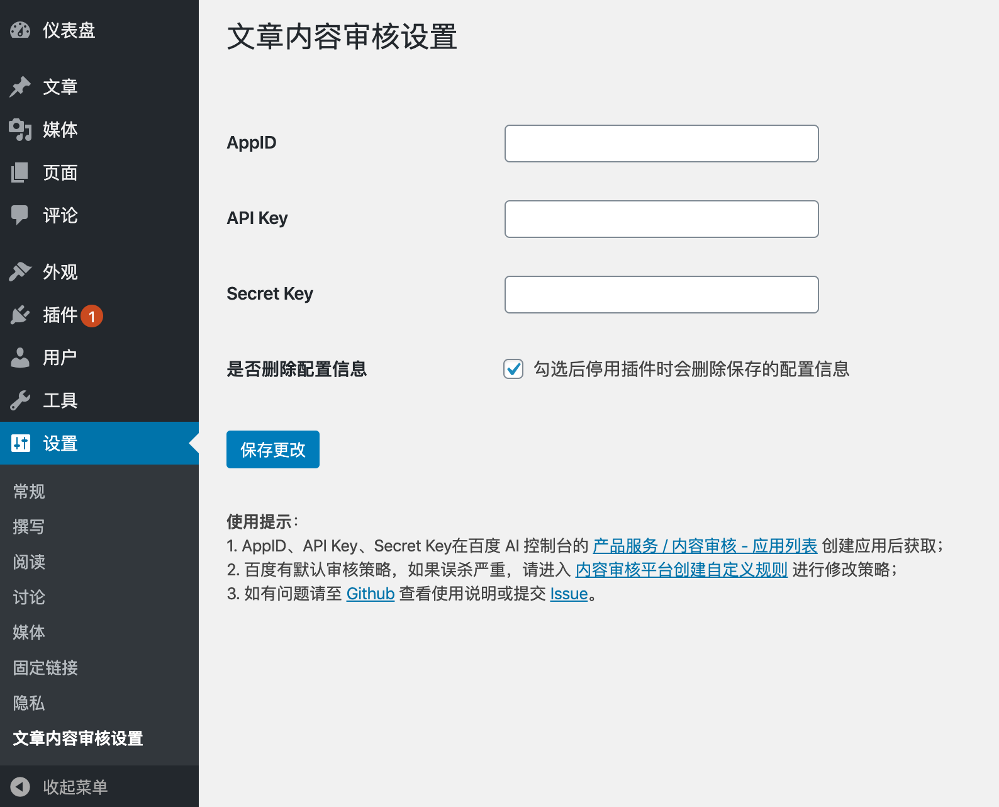

<h2 align="center">TextCensor For Articles</h2>

基于百度文本审核技术来提供WordPress文章内容审核，作者提交的文章中如若夹杂了推广、反动、色情信息，会给内容平台带来极大的法律风险，应用文本审核可帮助解决个人和企业一直以来困扰和担心的问题。

## 安装

### 推荐使用

在 WordPress 后台安装插件页面搜索 `TextCensor For Articles`

### 下载源码

从 Github 或 [WordPress Plugins](https://wordpress.org/plugins/textcensor-for-articles/) 下载源码，通过 WordPress 后台上传安装，或者直接将源码上传到 WordPress 插件目录 `wp-content/plugins`，然后在后台启用

## 设置

在百度Ai控制台的 [产品服务 / 内容审核 - 应用列表 创建应用](https://console.bce.baidu.com/ai/?fromai=1#/ai/antiporn/app/list) 后获取 AppID、API Key、Secret Key

## 评论内容审核

请使用`Baidu TextCensor For Comments`插件。

[Github](https://github.com/sy-records/wp-baidu-textcensor)、[WordPress Plugins](https://wordpress.org/plugins/baidu-textcensor/)

## 其他插件推荐

* [wordpress-qcloud-cos](https://github.com/sy-records/wordpress-qcloud-cos) 使用腾讯云对象存储服务 COS 作为附件存储空间
* [push-message-to-wechat](https://github.com/sy-records/push-message-to-wechat) 基于 PushBear 服务提供 WordPress 内容更新微信订阅推送，需要微信认证订阅号/服务号

## License

Apache-2.0
